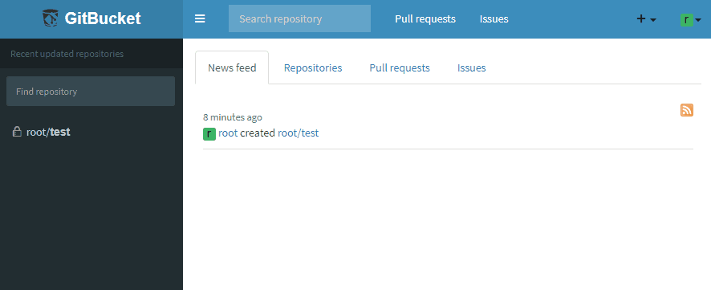

# gitbucket-navlink-plugin 
GitBucket plugin which adds a link to navigation bar



## Compatibility

Plugin version | GitBucket version
:--------------|:--------------------
1.1.X          | 4.32.0 -
1.0.1          | 4.23.1 - 4.31.2

## Development

```bash
# Initialize GitBucket and PostgreSQL containers
docker-compose up -d

# Setup GITBUCKET_HOME
# export GITBUCKET_HOME=/home/sikebe/git/github/gitbucket-navlink-plugin/docker
export GITBUCKET_HOME=<path-to-repository>/docker

# Build and copy assembly to GITBUCKET_HOME/plugins/
sbt install
```

## Build and deploy

Run `sbt assembly` and copy generated `/target/scala-2.13/gitbucket-navlink-plugin-X.X.X.jar` to `GITBUCKET_HOME/plugins/`.
