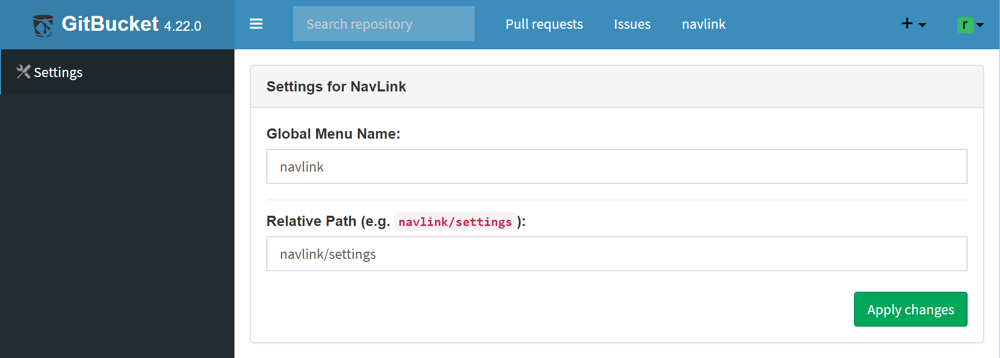

# gitbucket-navlink-plugin
GitBucket plugin which adds a link to navigation bar

## Compatibility

Plugin version | GitBucket version
:--------------|:--------------------
1.1.X          | 4.32.0 -
1.0.1          | 4.23.1 - 4.31.2

## Build from source

Run `sbt assembly` and copy generated `/target/scala-2.13/gitbucket-navlink-plugin-X.X.X.jar` to `~/.gitbucket/plugins/` (If the directory does not exist, create it by hand before copying the jar), or just run `sbt install`.