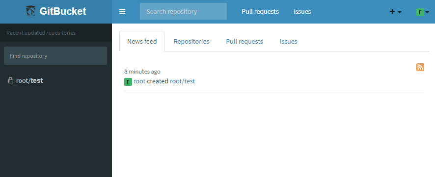

# gitbucket-navlink-plugin 
GitBucket plugin which adds a link to navigation bar



## Compatibility

Plugin version | GitBucket version
:--------------|:--------------------
1.2.X          | 4.35.0 -
1.1.X          | 4.32.0 - 4.34.0
1.0.1          | 4.23.1 - 4.31.2

## Development

### Dev Containers / Codespaces

Open the repository in VS Code Dev Containers or GitHub Codespaces to use the preconfigured `.devcontainer/devcontainer.json` image (Java 17, sbt, Node.js, Docker). After attaching to the container, create the plugins directory with `mkdir -p docker/plugins`, then start GitBucket and PostgreSQL with `docker compose up -d` from the workspace root if needed.

### GitHub Copilot

This project includes a `.github/workflows/copilot-setup-steps.yml` file that automatically sets up the development environment when using GitHub Copilot Coding Agent. The setup includes:
- Installing SBT (Scala Build Tool)
- Starting Docker Compose services (GitBucket + PostgreSQL)
- Setting up environment variables
- Installing E2E test dependencies
- Building and installing the plugin

### Manual Setup

```bash
# Initialize GitBucket and PostgreSQL containers
docker compose up -d

# Setup GITBUCKET_HOME
# export GITBUCKET_HOME=/home/sikebe/git/github/gitbucket-navlink-plugin/docker
export GITBUCKET_HOME=<path-to-repository>/docker

# Build and copy assembly to GITBUCKET_HOME/plugins/
sbt install
```

## Testing

### E2E Tests

End-to-end tests are available using Playwright. See [e2e/README.md](e2e/README.md) for details.

```bash
# Run E2E tests
cd e2e
npm install
npm test
```

## Build and deploy

Run `sbt assembly` and copy generated `/target/scala-2.13/gitbucket-navlink-plugin-X.X.X.jar` to `GITBUCKET_HOME/plugins/`.
